# Proyecto: Pipeline de Carga de Datos (Kinesis → S3 → Databricks)

###### Este proyecto se realizó con fines educativos para entender los servicios e interconexiones entre AWS (Kinesis, S3, IAM) y Databricks. Utiliza un script en Python para simular la creación y envío de datos.

### 0. Archivo obtenido del Kaggle para realizar la carga de un archivo .csv
* https://www.kaggle.com/datasets/shaistashahid/child-labor-statistics
    * child_labor_statistics - child_labor_statistics_20251214_123456.csv
### 1. Configuración Local 
* Descarga la herramienta virtualenv y la instala para el usuario actual.
```
py -m pip install --user virtualenv
```
* Utiliza la herramienta __virtualenv__ para crear un nuevo entorno virtual de Python y lo nombra __.venv__.
```
py -m virtualenv .venv
```
* Comando se usa en Windows PowerShell para activar tu entorno virtual de Python.

__Windows__
```
.\.venv\Scripts\activate.ps1
```
* Instalar las dependecnias para trabajar con AWS y Pandas
```
pip install boto3 pandas
```
* Instalar referencia de Kaggle
```
pip install kagglehub
```
### 2. Configuración de servicios en 
* Seteamos las variables __\$REGION__, __\$DELIV__ y __\$STREAM__ en el PowellShell
```
# Region donde queremos crear el servicio
$REGION = "us-east-1"
# Nombre del servicio de Kinesis
$STREAM = "jm-demo-kinesis-lab"
# Nombre del servicio Kinesis Firehose
$DELIV="salud-firehose-tos3"
```
* Creará el rol FirehoseToS3Role y establecerá la confianza para que Kinesis Data Firehose pueda utilizarlo.
```
aws iam create-role `
--role-name FirehoseToS3Role `
--assume-role-policy-document file://aws-policy/firehose-trust.json
```
* Adjuntará la política en del archivo __firehose-policy.json__ al rol FirehoseToS3Role.
```
aws iam put-role-policy `
--role-name FirehoseToS3Role `
--policy-name firehoseInlinePolicy `
--policy-document file://aws-policy/firehose-policy.json
```
* Creamos el BUCKET donde queremos salvar y mantener la información
```
aws s3 mb s3://jm-demo-s3-lab
```
* Creamos el servicio __Kinesis__
```
aws kinesis create-stream --stream-name $STREAM --region $REGION `
--stream-mode-details StreamMode=ON_DEMAND
```
* Este método más eficiente para obtener una vista rápida y resumida del estado de tu Kinesis Data Stream.
```
aws kinesis describe-stream-summary --stream-name $STREAM --region $REGION `
--query "StreamDescriptionSummary.[StreamARN, StreamStatus, OpenShardCount]"
```
* Creamos el servicio de __Kinesis Firehose__
```
aws firehose create-delivery-stream --cli-input-json file://delivery.json --region $REGION
```
* Devuelver una cadena de texto que indica el estado actual del Delivery Stream.
> __CREATING__: (Creando) El estado inicial después de ejecutar create-delivery-stream. El recurso está siendo aprovisionado y no puede recibir datos todavía.

> __ACTIVE__: (Activo) Este es el estado deseado. Significa que el Delivery Stream está listo para recibir datos desde tu Kinesis Stream y comenzar a entregarlos a S3.

> __DELETING__: (Eliminando) Si hubieras ejecutado un comando de eliminación.
```
aws firehose describe-delivery-stream --delivery-stream-name $DELIV --region $REGION `
--query "DeliveryStreamDescription.DeliveryStreamStatus"
```
* Retorna informacion sobre ARN, shards y status
```
aws kinesis describe-stream-summary --stream-name $STREAM --region $REGION `
--query "StreamDescriptionSummary.[StreamARN, OpenShardCount, StreamStatus]"
```
* Retorna informacion sobre shards
```
aws kinesis list-shards --stream-name $STREAM --region $REGION `
--query "Shard[].{Id:ShardId}" --output table
```
### 3. Configuración entorno  Databricks

#### En este proyecto se trabajó con la Arquitectura de datos Medallion, consta de lo siguiente:

>  **Bronce (RAW):** se refiere a la data cruda sin procesar, en su formato original, para auditoría y una fuente única de verdad.
> **Plata (CLEAN):** datos filtrados, enriquecidos y estructurados, listos para análisis detallados.
> **Oro:** datos altamente agregados y transformados, listos para uso empresarial y reportes de negocio.
>
> Para muestra de este proyecto solo trabajaremos con **Bronce y Silver**. Donde, Bronze esta comprendida en los archivos cargados en el S3 y traspasados al Databricks por medio de una ETL.

## Configuración de seguridad
| Característica   | Unity Catalog              | Instance Profiles                | Databricks Secrets             |
|:--------------   |:-------------------------- |:-------------------------------- |:-------------------------------|
| Seguridad        | Máxima (Delegación de Rol) | Alta (Acceso a nivel de clúster) | Media (Uso de llaves cifradas) |
| Gobernanza       | Centralizada en Databricks | A nivel de infraestructura AWS   | Manual por notebook o clúster  |
| Facilidad de uso | Alta (Nativo)              | Muy Alta (Transparente)          | Baja (Requiere código)         |

#### **Nota**: para este caso se usa **Gobernanza**. Con el fin de no tener que usar *Access key ID* y el *Secret access key*. Los pasos fueron los siguientes:
> Ir a **Home** a la sección *Connect your data*, con la siguiente imagen:
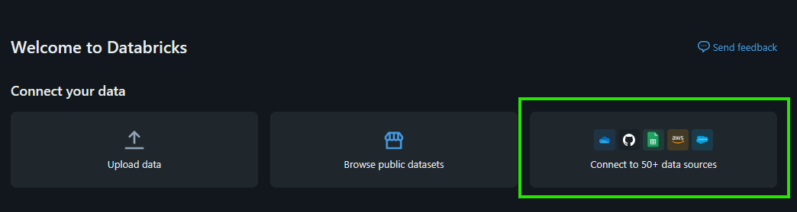

> Seleccionar Amazon S3
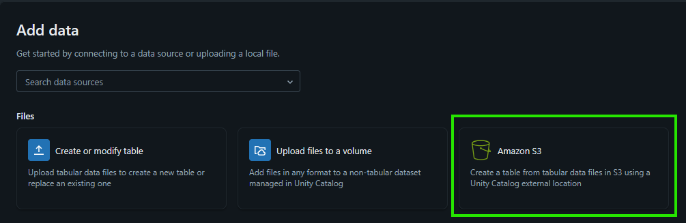

> Seleccionar la opción **Create new external location**
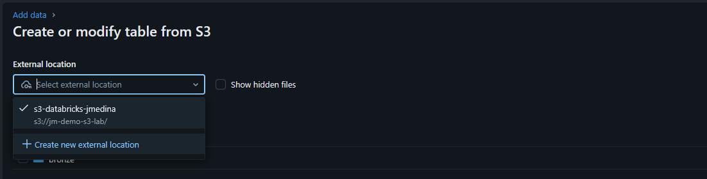

> Elegimos la opción Manual


> En la siguiente pantalla colocaremos:
    * External lcoation name, el nombre con el que queremos llamar la conexión.
    * Storage type, para nuestro ejemplo usaremos S3 como veniamos haciendo en el proyecto.
    * URL, colocaremos la ruta del bucket con sus respectivas carpetas, ejemplo: **s3://bucket-name**
    * Storage credential, seleccionamos la opción *Create new storage credential*
    * IAM role (ARN), seleccionamos el rol creado anteriormente llamado FirehoseToS3Role y pegamos el ARN que está en AWS que tendrea la siguiente forma en tus roles: **arn:aws:iam::123456789123:role/FirehoseToS3Role**
    * Comment, puedes colocar algo descriptivo para esta nueva conexión.
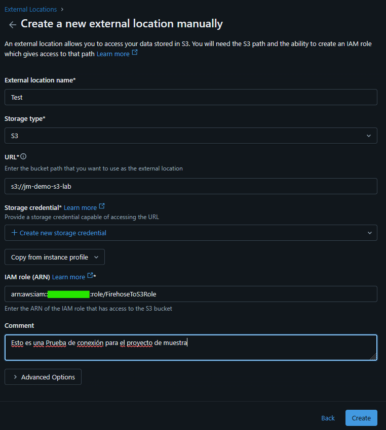

> Al presionar el butón *Create*, aparecerá la siguiente pantalla:
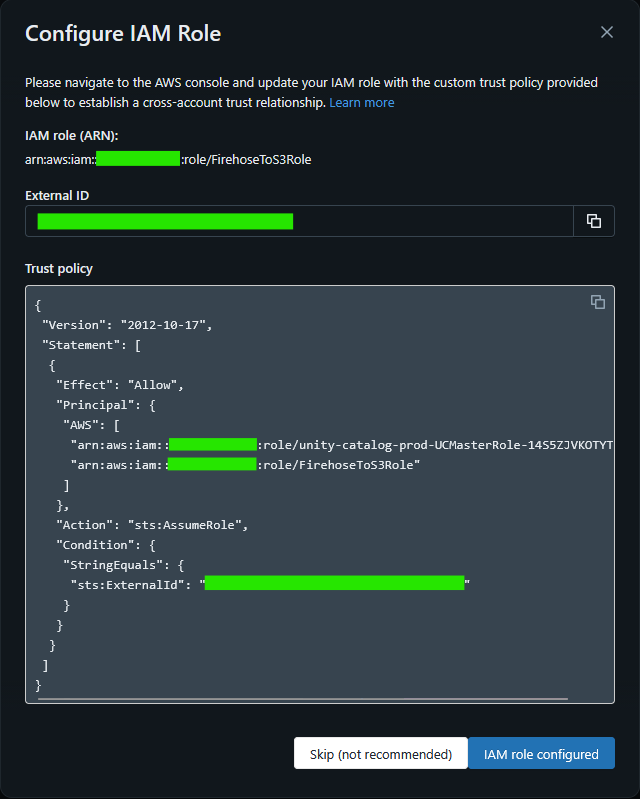
    * Ese JSON es el que vamos a copiar en el ROL *FirehoseToS3Role* -> *Trust Relationships* que se encuentra en AWS -> IAM.

> Probamos la conexión en el botón que se encuentra en el lado superior derecho y aparecerá la pantalla que se encutra en el centro con la información que está contenida en el recuadro verde central.
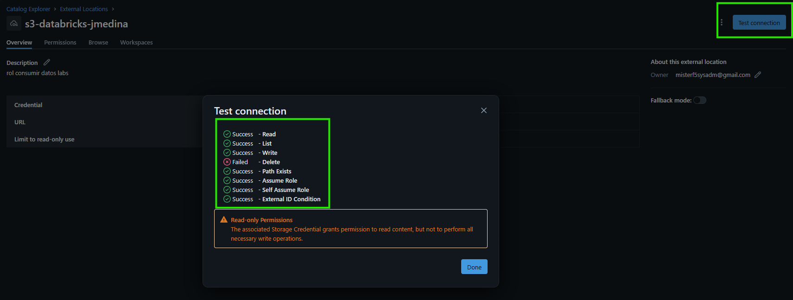

> Vamos a la sección *SQL Editor* y creamos una nueva query. Usaremos el script que se encuentra en la carpeta databricks/sql del proyecto 
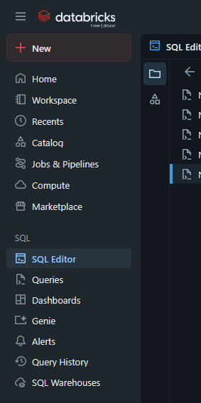

> Crearemos nuestro primer pipeline en la sección
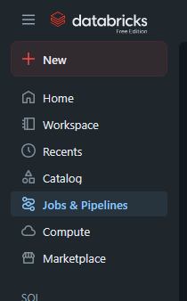

> Vamos al bontón *Create -> ETL pipeline* 
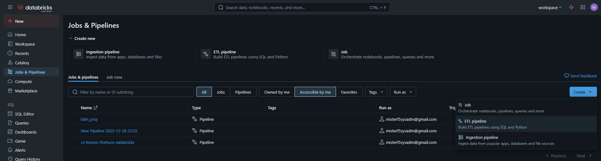
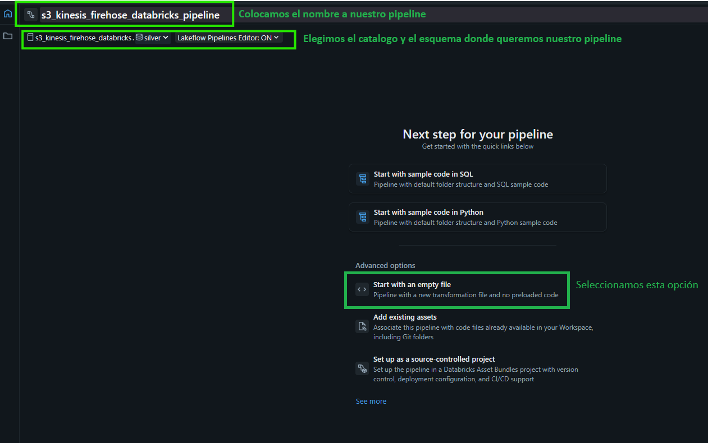

> Elegimos la ruta de carpeta donde queremos dejar el pipeline y seleccionamos el lenguaje que usaremos en este caso **Python**
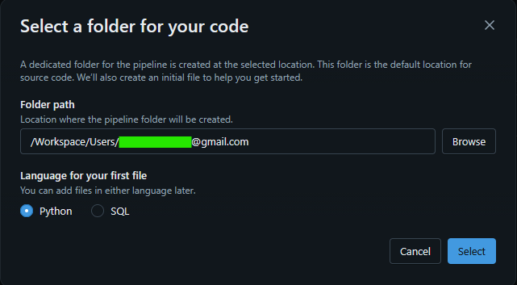

> Renombramos el archivo Python *my_transformation.py -> my_ingest.py*. Copiamos el contenido del código que se encuentra en la ruta del proyecto *databricks/python/my_ingest.py* y pegamos como se ve en la imagen siguiente:


> Creamos un nuevo archivo llamado my_silver.py y pegamos el contenido del archivo *my_transformation.py -> my_silver.py* y pegamos como se ve en la imagen:
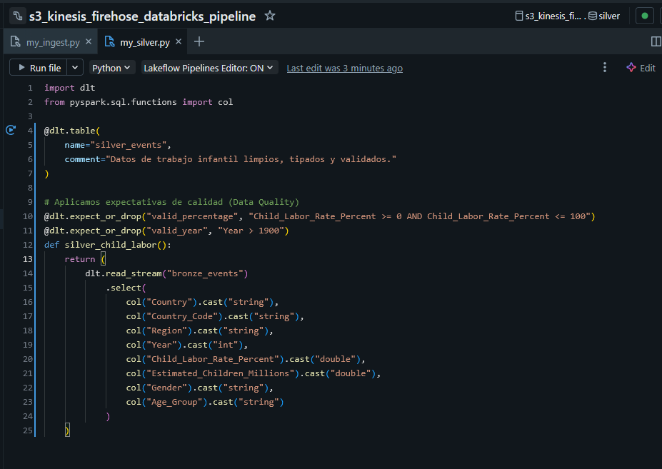
Aquí creamos la otra parte de la arquitectura que es *PLATA*, en este proceso se formatean los datos para una posterior presenteación.

> En la parte derecha de los pipelines, vera un botón que mostrará el flujo de la ETL, se ve de la siguiente manera:
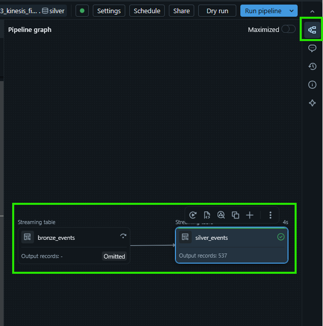

> Revisando *Catalogo* vemos lo siguiente:
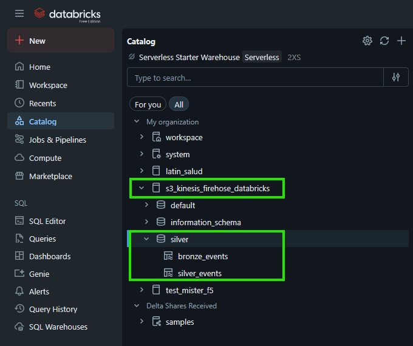

> Se pueden ver que ambos archivos python generaron Streaming Tables

# Para la parte Oro habria que crear una visualización. Pero por ahora concluiremos con esto...